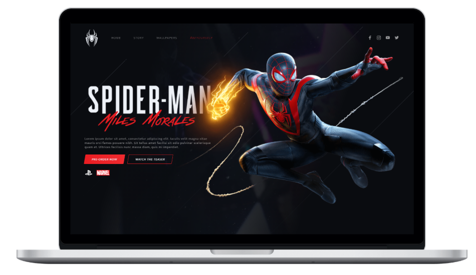

<h1 align="center">
  
</h1>

<p align="center">
          
</p>

<div align="center">
    
</div>

## 🛠 Technology

- **Front-End**
  - [HTML](https://developer.mozilla.org/pt-BR/docs/Web/HTML)
  - [SASS](https://sass-lang.com/)
  - [Javascript](https://developer.mozilla.org/pt-BR/docs/Web/Javascript)
  
- **Back-End**
  - [Node.js](https://nodejs.org/en/)
  
## 💻 Project

This project is a web application simulating the site the new game from playstations Spiderman: Mires Moorales.

## 🔖 Layout

You can view the layout of this project by clicking [here](https://spiderman-gamma.vercel.app/).

## 🖥 Environment Support

| [](http://godban.github.io/browsers-support-badges/)<br>IE / Edge | [](http://godban.github.io/browsers-support-badges/)<br>Firefox | [](http://godban.github.io/browsers-support-badges/)<br>Chrome | [](http://godban.github.io/browsers-support-badges/)<br>Safari |
| --- | --- | --- | --- |
| IE11, Edge | last 5 versions | last 5 versions | last 5 versions |

## ⬆ Updates

This project is being the basis for my learning, so I make constant changes to it.

## 💡 Implementation ideas

- [ ] Final adjustments;
- [ ] Refactor;
- [ ] Improve responsiveness.

## 📂 Directory structure

```
|-- .github/
|-- public/
  |-- assets/
  |-- scripts/
  |-- styles/
    |-- css/
    |-- scss/
  |-- index.html
|-- src/
  |-- server.js
|-- .gitignore
|-- LICENSE.md
|-- package.json
|-- README.md
```

## ⬇ Installation

You will need [Nodejs](https://nodejs.org/en/) and [git](https://git-scm.com/) installed on your machine. Then, you can run the scripts below:

```bash
# Clone this repository
$ git clone https://github.com/roger3g/spiderman.git

# Access the project folder in the cmd/terminal
$ cd spiderman

# Install the dependencies
$ npm install

# Run the sass (It is important that you have sass installed)
$ npm run dev:sass

# Run the application in development mode
$ npm run dev:server

# The port that the server will open will be shown on the console
```

## 🤔 How to contribute

1. Fork this repository;
2. Create a branch with your feature: **`git checkout -b my-feature`**;
3. Commit your changes: **`git commit -m 'feat: My new feature'`**;
4. Push to your branch: **`git push origin my-feature`**.

After the merge of your pull request is done, you can delete your branch.

You can report a bug [here](https://github.com/roger3g/spiderman/issues).

## 📝 License

This project is under the MIT license. See the archive [LICENSE](LICENSE.md) for more details.
